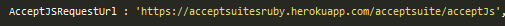
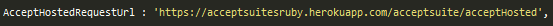
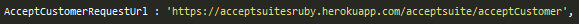
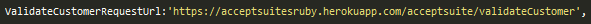
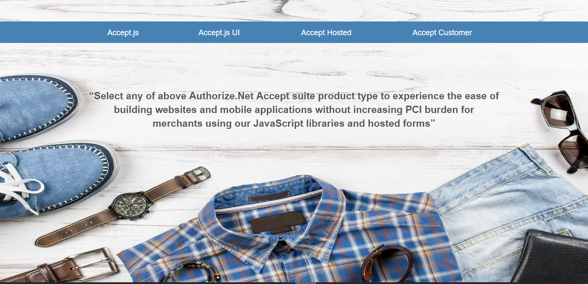

# Accept Suite Integration with .Net Core WEB API

One Paragraph of project description goes here

## Getting Started

These instructions will get you a copy of the project up and running on your local machine for development and testing purposes. See deployment for notes on how to deploy the project on a live system.

## Prerequisite:
*	Windows 10 Professional
*	Sublime Text or any editor of your choice.
*	Internet Information Services 10

## Very detailed explanation of each product type.
Authorized.Net Accept suite has below products.
*	Accept JS
*	Accept UI
*	Accept Hosted
*	Accept Customer

Detailed explanation of each product are available in the below links.
https://developer.authorize.net/api/reference/features/accept.html
https://developer.authorize.net/api/reference/features/acceptjs.html
https://developer.authorize.net/api/reference/features/accept_hosted.html
https://developer.authorize.net/api/reference/features/customer_profiles.html#Using_the_Accept_Customer_Hosted_Form

## Integration
Constants.js file consists of required URLs that are used for WEB API calls and constant parameters that are used throughout the application.

The URLs should be provided with IP address and API service site port number in the following format.
https://IPAddress:PortNumber/api/AcceptSuite/<ApiMethodName>

* AcceptJSRequestUrl : URL to invoke Accept JS web service on payment.

* AcceptHostedRequestUrl : URL to get the token value for Accept Hosted.

* AcceptCustomerRequestUrl : URL to get the token value for Accept Customer.

* ValidateCustomerRequestUrl : URL to invoke a web api method to validated customer ID.

 

The following are the parameters with values that remains constant throughout the application. These parameters are used in script through Ajax calls for performing payments.

* ClientKey 

* ApiLoginID

* ApiTransactionKey

### Create Website on IIS

*	Open IIS as Administrator.

*	Right click on sites and select “Add Website”. 

*	Provide Site name and physical path to the app’s deployment folder(C:\inetpub\wwwroot\Publish)

*	Choose https binding.

* 	Select SSL Certificate from drop down.

*   Click OK.

	

## browse the website

Sample URL: https://10.173.192.248:5008/index_all.html

